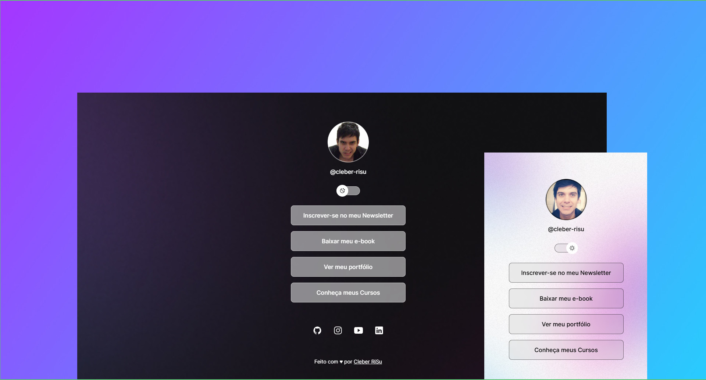

<h1 align="center">My Link Aggregator</h1>

  

## 🚀 Tecnologias

Esse projeto foi desenvolvido com as seguintes tecnologias:

- HTML e CSS
- JavaScript
- Git e GitHub
- Figma

## 💻 Projeto

Um agregador de links para usar como cartão de visitas online.

- [Acesse o projeto finalizado, online](https://github.com/cleber-risu/my-link-aggregator)

## :memo: Licença

Esse projeto está sob a licença MIT.

---

Feito com ♥ by Cleber-Risu
